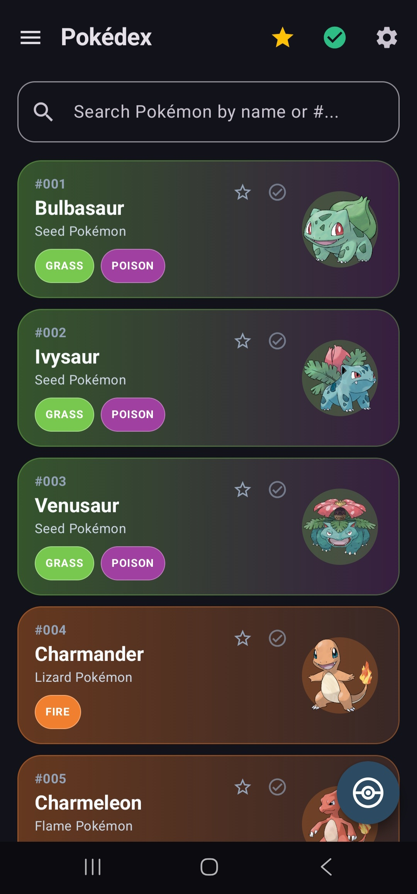
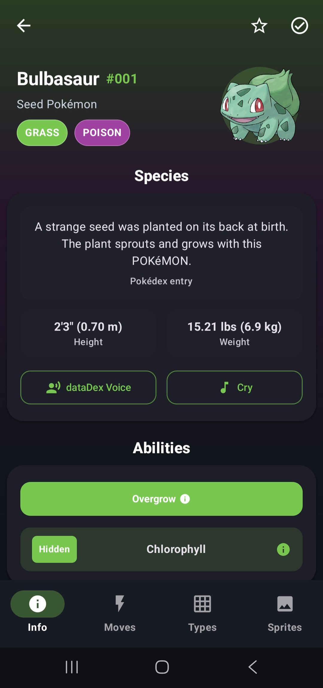
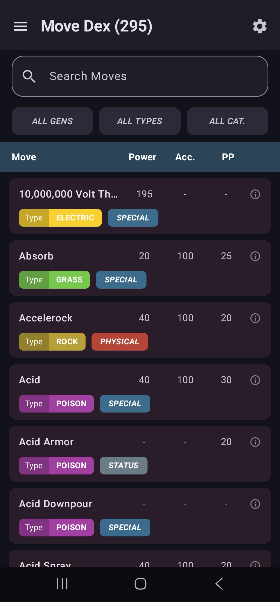
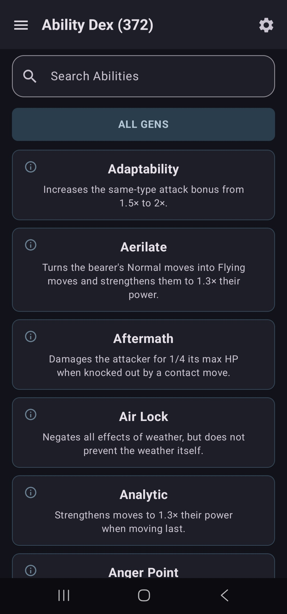
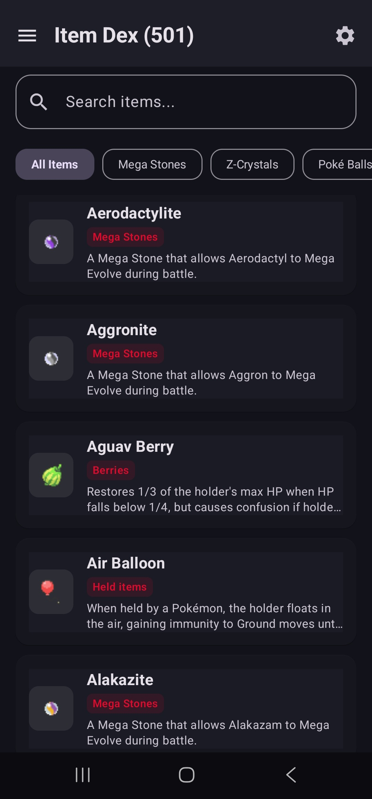
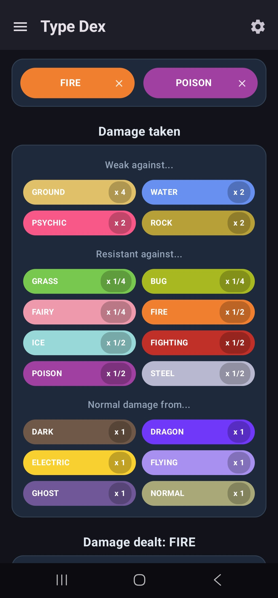
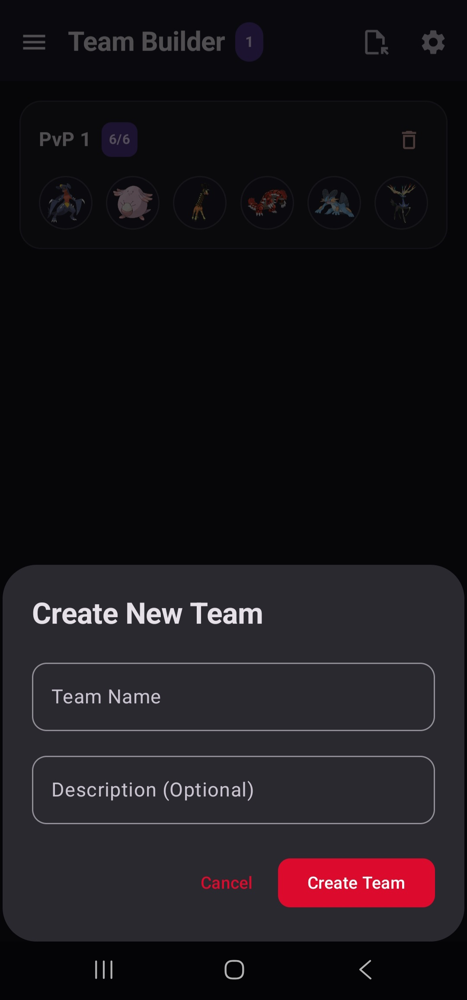
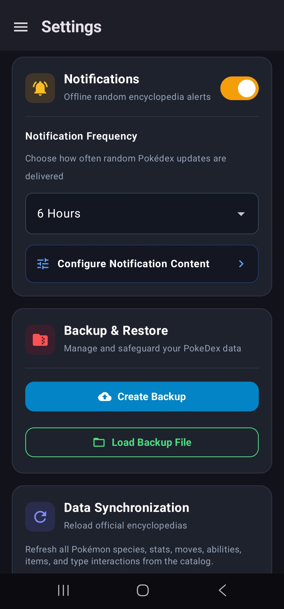

# Déxora

**A modern, feature-rich Pokédex for discovering, analyzing, and building Pokémon teams.**

Déxora is a fully functional Pokédex application designed to provide a rich and convenient Pokémon reference experience in a modern dark-themed interface. From detailed Pokémon information and advanced search to team building, moves, abilities, items, types, natures, favorites, caught tracking, and more — Déxora brings the essential tools of a comprehensive Pokédex into one app.

## ✨ Features

### 📖 Comprehensive Pokédex

Explore detailed information for Pokémon, including:

* Pokémon descriptions and Pokédex entries
* Pokémon artwork and images
* Typing and type combinations
* Abilities
* Base stats
* Evolution chains
* Learnable moves
* Type effectiveness analysis
* And much more

### ⚔️ Move Dex

Browse detailed information about Pokémon moves, making it easy to understand what each move does and how it works.

### 🧬 Ability Dex

Explore Pokémon abilities with dedicated details and descriptions.

### 🎒 Item Dex

Browse items and discover which items Pokémon can hold or use.

### 🔥 Type Dex

Visually analyze Pokémon types and their relationships, including type effectiveness and type combinations.

### 🌿 Nature Dex

Quickly check what each Pokémon Nature does and understand its effects.

### 👥 Team Builder

Build and manage Pokémon teams of up to **6 Pokémon**.

Create teams while considering Pokémon typings, type matchups, and overall team composition.

### 🔎 Advanced Search

Find what you're looking for quickly with Dexora's advanced search mechanism.

Search across the available Pokédex data without having to manually browse through large lists.

### ❤️ Favorites & Caught Tracking

Personalize your Pokédex experience:

* Mark Pokémon as **Favorite**
* Mark Pokémon as **Caught**
* Easily keep track of your collection and preferred Pokémon

### ⚙️ Settings

Manage your Déxora experience from a dedicated settings section.

Available options include:

* Create backups
* Restore backups
* Notification settings
* Other application preferences

### 🆕 What's New?

Stay informed about new features, improvements, and changes introduced in app updates through the built-in **What's New** section.

### 💬 Help & Feedback

Have an issue or suggestion?

Use the in-app Help & Feedback section to submit feedback directly from Dexora.

### 📱 In-App Updates

Keep Dexora up to date with built-in update support, allowing users to receive the latest improvements and features.

### ℹ️ About

The About section provides important information about Dexora, including:

* Application information
* Current version
* Privacy Policy
* Terms of Use

## 🖼️ Screenshots

> Screenshots will be added here to showcase Déxora's interface and major features.

|                     Pokédex                    |                         Pokémon Details                        |
| :--------------------------------------------: | :------------------------------------------------------------: |
|  |  |

|                     Move Dex                     |                       Ability Dex                      |
| :----------------------------------------------: | :----------------------------------------------------: |
|  |  |

|                     Item Dex                     |                     Type Dex                     |
| :----------------------------------------------: | :----------------------------------------------: |
|  |  |

|                       Team Builder                       |                     Settings                     |
| :------------------------------------------------------: | :----------------------------------------------: |
|  |  |

## 🎨 Design

Déxora features a **rich dark-mode interface** designed to provide a modern, immersive, and comfortable browsing experience.

The interface focuses on:

* Clean and modern UI
* Information-rich layouts
* Easy navigation
* Clear visual hierarchy
* Pokémon-focused visuals
* Fast access to commonly used features

## 🆓 Free to Use

Déxora is **free to use**, providing its Pokédex functionality without requiring users to pay for access to the core features.

## 🔐 Privacy & Terms

Déxora provides dedicated **Privacy Policy** and **Terms of Use** information within the application.

Please refer to the corresponding documents in the repository or the **About** section of the app for the latest legal information.

## 💡 Feedback & Bug Reports

Found a bug, have a feature request, or want to suggest an improvement?

You can use Déxora's built-in **Help & Feedback** feature or open an issue in this repository.

When reporting a bug, providing the following information can help:

* Description of the issue
* Steps to reproduce it
* Expected behavior
* Actual behavior
* App version
* Device/platform information
* Screenshots or other relevant details

## 📜 License

Déxora is currently **not open source**. The source code is not publicly available in this repository.

The repository is intended for project information, documentation, release information, screenshots, and other publicly available resources related to Déxora.

All rights reserved unless otherwise stated.

## 🙌 Acknowledgements

Déxora would not be possible without the Pokémon community and the various open data resources that make Pokémon information accessible to developers and fans.

**Pokémon and Pokémon character names are trademarks of Nintendo, Game Freak, and The Pokémon Company. Déxora is a fan-made application and is not affiliated with, endorsed, or sponsored by Nintendo, Game Freak, or The Pokémon Company.**

---

  Made with ❤️ for Pokémon fans

